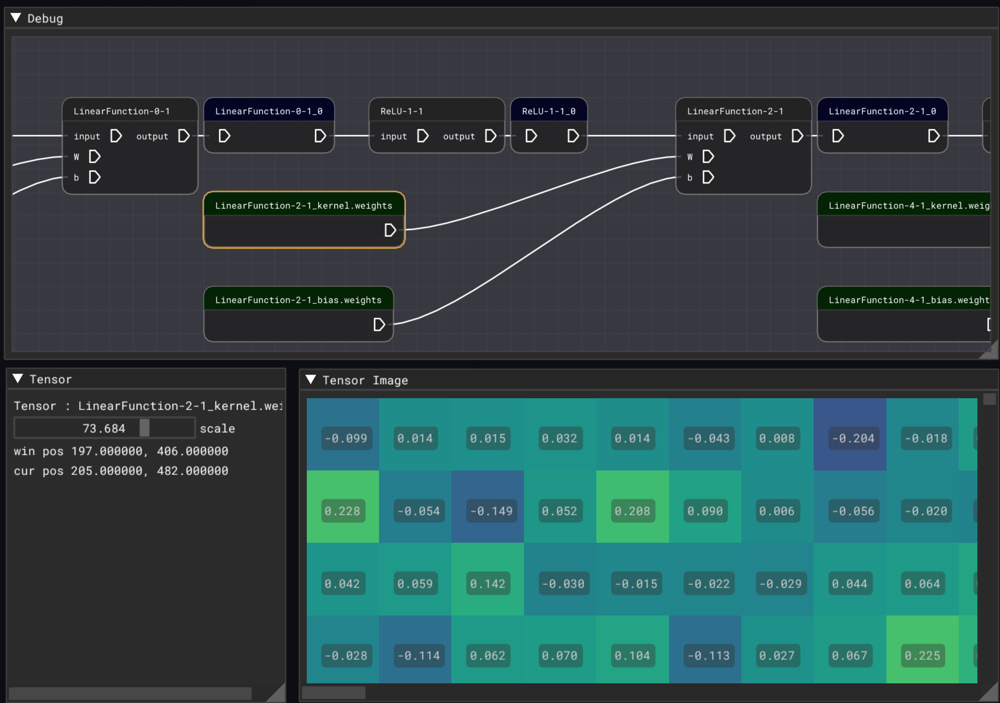

# nnview, neural network viewer

nnview can display weights and graph structure of neural network model.



## Status

Very early stage. W.I.P.

* [x] LinearFunction
* [x] ReLU
* [ ] Convolution2D
* [ ] and more


## How it works

* Read graph definition in JSON
* Read weight data
* Plot graph
* Plot weight data

## Build

### Requirements

* C++14 compiler(imgui-node-editor requires C++14. Other component can be compiled with C++11) 
* Cmake
* OpenGL 3.x(imgui-node-editor requires GL 3.x)

### cmake options

* NNVIEW_USE_CCACHE On/Off : Compile with ccache
* NNVIEW_USE_NATIVEFILEDIALOG On/Off Use NativeFileDialog. default on for Windows and macOS
* `SANITIZE_ADDRESS=On` : Enable address sanitizer. Requires clang or recent gcc.


### BUild on Linux and macOS

See `scripts/bootstrap-linux.sh` and `scripts/bootstrap-macos.sh` for examle cmake bootstrapping.

### Build on Windows(Visual Studio 2017)

```
> vcsetup.bat
```

Solution file will be generated into `build` folder.

## UI

### Graph

* 'F' key to fit view 
* right mouse drag to pan view


### Supported format

Currently we only support JSON and weight generated by Chainer-TRT(https://github.com/pfnet-research/chainer-trt)

## License

MIT license

## TODO

* [ ] Support `.tflite` format(TensorFlow-Lite, Flatbuffers format)
* [ ] Support weight data in NPY(numpy) or NPZ(numpy zip compressed) format.
* [ ] Use nlohmann json.hpp or rapidjson for JSON schema validation.
* [ ] Better graph layout.

### Third party licences

* imgui : Public domain
* imgui-node-editor : Copyright (c) 2019 Michał Cichoń. MIT license.
* glfw3 : zlib license
* nativefiledialog : zlib license
* roboto font : Apache 2.0 license
* json11 : MIT license. https://github.com/dropbox/json11
